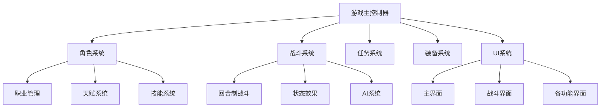

## 用户需求

用户要求制作一个名为 "Chicken Bro Adventure" 的网页像素风格文字回合制冒险游戏的完整设计文档。

## 产品概述

这是一款以勇敢的鸡哥为主角的网页端像素风格文字回合制冒险游戏，背景设定参考魔兽世界60级经典版本。游戏包含9大职业系统，每个职业拥有3套天赋树，最高等级60级。玩家将在一个充满冒险和挑战的世界中展开旅程。

## 核心功能

- **角色系统**：9大职业选择，每个职业独特技能和天赋树，三大职责分工（坦克、DPS、治疗）
- **战斗系统**：参考暗黑地牢的回合制战斗机制，分为野外和地下城两类场景
- **任务系统**：包含主线任务、支线任务和日常任务的完整任务体系
- **装备系统**：多品质等级装备，职业专属装备和套装系统
- **天赋系统**：每个职业3套天赋树，支持多样化角色发展路线
- **制造系统**：锻造、炼金等制造职业，支持装备和道具制作
- **副本系统**：组队挑战不同难度等级的副本内容
- **技能系统**：主动技能、被动技能和团队技能的完整技能体系
- **UI界面**：像素风格文字UI，包含主界面和战斗界面的完整界面系统
- **随机事件**：突发事件、隐藏宝藏等随机挑战内容

## 技术栈选择

### 前端技术栈

- **框架**：HTML5 + CSS3 + JavaScript (ES6+)
- **样式**：CSS Grid/Flexbox 布局，像素风格设计
- **字体**：等宽字体支持像素风格文字显示
- **动画**：CSS动画和JavaScript控制的帧动画

### 数据存储

- **本地存储**：LocalStorage 用于游戏存档和设置
- **数据格式**：JSON 格式存储游戏状态和配置

### 架构设计

#### 系统架构

采用模块化架构模式，将游戏系统按功能划分为独立模块：



#### 实现方案

**模块化设计**：每个游戏系统作为独立的JavaScript模块，通过事件系统进行通信。

**数据驱动**：游戏内容通过JSON配置文件定义，支持灵活的内容扩展和修改。

**状态管理**：采用集中式状态管理，游戏状态统一管理和持久化。

#### 实现细节

**性能优化**：

- 使用对象池管理游戏实体，减少垃圾回收
- 战斗计算采用批处理，避免频繁DOM操作
- 图像资源预加载和缓存机制

**用户体验**：

- 响应式设计，支持不同屏幕尺寸
- 键盘快捷键支持，提升操作效率
- 自动保存机制，防止进度丢失

#### 目录结构

```
ChickenBro/
├── docs/                           # 设计文档目录
│   ├── game-design-document.md     # [NEW] 游戏设计总文档
│   ├── character-system.md         # [NEW] 角色系统设计文档
│   ├── combat-system.md            # [NEW] 战斗系统设计文档
│   ├── quest-system.md             # [NEW] 任务系统设计文档
│   ├── equipment-system.md         # [NEW] 装备系统设计文档
│   ├── talent-system.md            # [NEW] 天赋系统设计文档
│   ├── crafting-system.md          # [NEW] 制造系统设计文档
│   ├── dungeon-system.md           # [NEW] 副本系统设计文档
│   ├── skill-system.md             # [NEW] 技能系统设计文档
│   ├── ui-system.md                # [NEW] UI系统设计文档
│   └── random-events.md            # [NEW] 随机事件设计文档
├── assets/                         # 游戏资源目录
│   ├── data/                       # 游戏数据配置
│   └── styles/                     # 样式文件
├── src/                            # 源代码目录
│   ├── systems/                    # 游戏系统模块
│   ├── ui/                         # UI组件
│   └── utils/                      # 工具函数
└── openspec/                       # OpenSpec规范目录
    └── changes/game-design-document/ # 当前变更目录
```

#### 关键代码结构

**游戏系统接口**：定义统一的游戏系统接口，确保各系统间的一致性和可扩展性。

**事件系统**：实现发布-订阅模式的事件系统，支持系统间的松耦合通信。

**数据模型**：定义游戏实体的数据结构，包括角色、装备、技能等核心数据模型。

## 推荐的代理扩展

### Skill

- **doc-coauthoring**
- 目的：指导用户完成结构化的游戏设计文档协作编写流程
- 预期结果：产出完整、结构化、专业的游戏设计文档，涵盖所有核心系统的详细规格

- **frontend-design**
- 目的：创建像素风格的游戏UI界面设计和视觉规范
- 预期结果：生成符合像素风格的UI设计方案，包括界面布局、色彩方案和交互设计

### SubAgent

- **code-explorer**
- 目的：探索和分析游戏系统的复杂结构和依赖关系
- 预期结果：深入理解各游戏系统间的关联性，确保设计文档的完整性和一致性