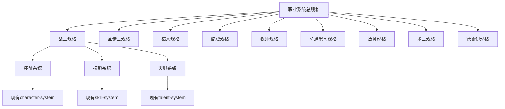

## 用户需求

基于魔兽世界60级经典版本，为9大职业设计详细的设计文档

## 产品概述

为《鸡哥大冒险》游戏创建完整的职业系统设计文档，涵盖魔兽世界经典版本的9个职业，每个职业包含装备需求、武器类型、核心技能和天赋系统的详细规格说明

## 核心功能

- 9大职业的完整设计文档（战士、圣骑士、猎人、盗贼、牧师、萨满祭司、法师、术士、德鲁伊）
- 每个职业的装备类型和武器需求规格
- 职业核心技能系统设计
- 职业专属天赋树设计
- 与现有游戏系统的集成规格

## 技术栈选择

- **文档格式**: Markdown
- **规范框架**: OpenSpec 规范驱动开发
- **结构模式**: "需求 -> 场景 -> 当/那么" 的BDD风格描述

## 实现方案

基于现有的 OpenSpec 变更管理结构，在 `game-design-document` 变更中创建职业系统的详细规格文档。

### 架构设计

采用模块化设计，每个职业作为独立的规格文档，同时与现有系统保持集成：



## 目录结构

```
openspec/changes/game-design-document/specs/
├── class-system/
│   ├── spec.md                    # 职业系统总规格
│   ├── warrior/
│   │   └── spec.md               # 战士职业详细规格
│   ├── paladin/
│   │   └── spec.md               # 圣骑士职业详细规格
│   ├── hunter/
│   │   └── spec.md               # 猎人职业详细规格
│   ├── rogue/
│   │   └── spec.md               # 盗贼职业详细规格
│   ├── priest/
│   │   └── spec.md               # 牧师职业详细规格
│   ├── shaman/
│   │   └── spec.md               # 萨满祭司职业详细规格
│   ├── mage/
│   │   └── spec.md               # 法师职业详细规格
│   ├── warlock/
│   │   └── spec.md               # 术士职业详细规格
│   └── druid/
│       └── spec.md               # 德鲁伊职业详细规格
```

## 实现细节

### 文档结构标准化

每个职业规格文档将包含：

1. **职业概述**: 角色定位、核心特色
2. **装备需求**: 护甲类型、武器类型、装备槽位
3. **核心技能**: 主要技能分类、技能效果、冷却时间
4. **天赋系统**: 天赋树分支、关键天赋节点
5. **系统集成**: 与现有系统的接口规格

### 性能考量

- 文档采用模块化设计，便于维护和扩展
- 使用标准化模板，确保一致性
- 预留扩展接口，支持未来新职业添加

### 兼容性设计

- 与现有 character-system、skill-system、talent-system 保持接口兼容
- 遵循现有的命名规范和数据结构
- 支持现有游戏引擎的数据加载机制

## 推荐的代理扩展

### Skill

- **openspec-new-change**
- 目的: 创建新的 OpenSpec 变更来管理职业系统设计文档
- 预期结果: 建立结构化的变更管理流程，确保文档创建的规范性和可追踪性

- **openspec-continue-change**
- 目的: 在现有的 game-design-document 变更中继续添加职业系统规格
- 预期结果: 与现有设计文档保持一致的结构和格式，实现无缝集成